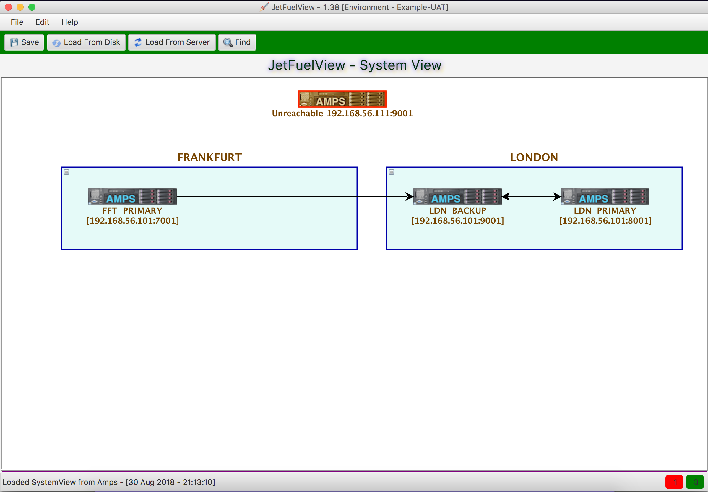
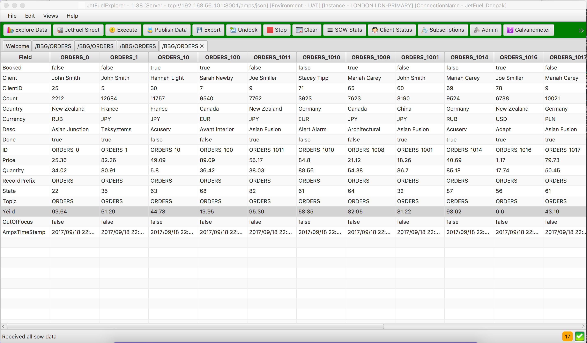

# JetFuelView
JetFuelView is an Amps admin viewer, that helps you to look at how Amps servers are connected to each other. It can also launch JetFuelExplorer to each instance.

This is a screenshot of the JetFuelView

JetFuelExplorer can be launched by right clicking on the amps instance in the view. This is a very powerful tool that can help you to do great things with amps. You can do the following 
* Subscribe to data and view the data in nice tables, tree or text format
* Draw graphs on various stats
* Publish test data, record and playback data
* Much much more

It is more advanced version of the spark tool that comes with amps. Have a look at this site https://jetfuel.solutions/ for more details.

Below are some sample views
* Showing data in a Horizontal table

* Showing data in a Vertical table

